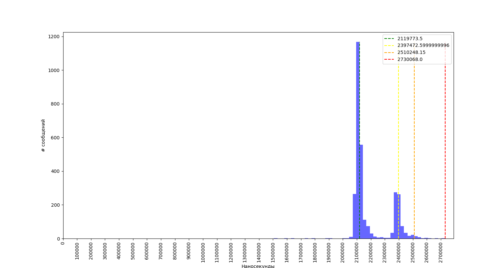
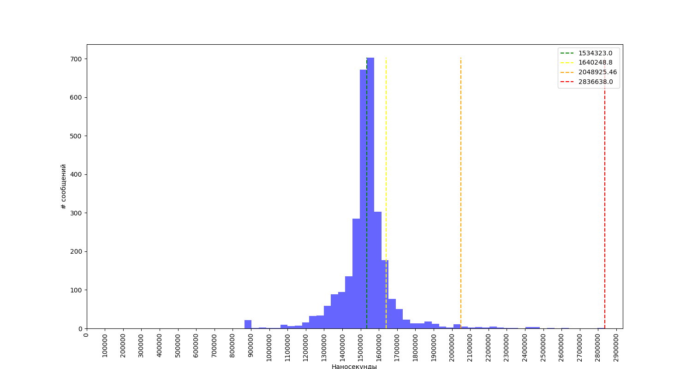
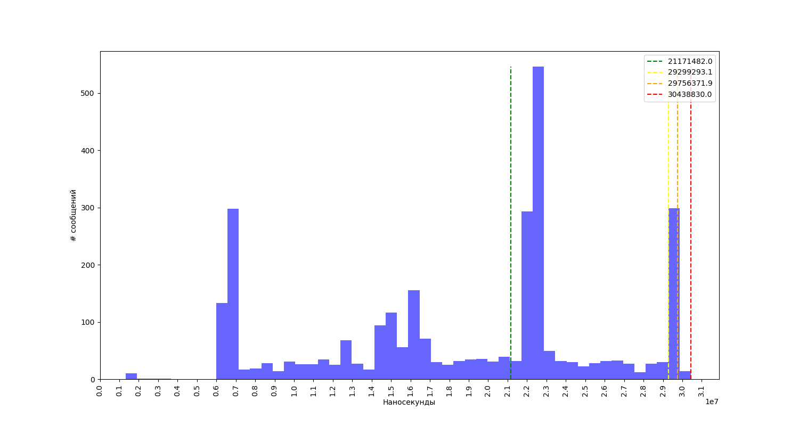

# Relay

## Условие задачи

### Исследование задержки передачи по TCP loopback
Необходимо написать тестовое приложение, позволяющее организовать передачу сообщения размером 1KB последовательно по цепочке из 5-ти звеньев (6 узлов, сообщение передаётся в 5 прыжков от 1-го к 6-му). Для написания сетевой части можно использовать любой удобный фрэймворк (Boost, Qt, POSIX, …). Сообщение должно включать временные метки, проставляемые узлами, для отслеживания времени распространения.
Воспользовавшись этим тестовым приложением нужно:

 1. Измерить перцентили 50-90-99-100 и построить гистограмму сквозного времени распространения сообщений (от 1-го к 6-му узлу) при частоте  передачи f = 100 Гц
 2. Найти частоту F, при которой 99-й перцентиль увеличивается в N = 5 раз
 3. Предложить оптимизации/настройки/изменения в системе для уменьшения времени передачи (по 99-му перцентилю) при найденной частоте F
 4. Привести сравнение измерений из п.1 до и после оптимизаций
 5. К решению необходимо приложить исходный код тестового приложения и утилиты для построения гистограмм / вычисления перцентилей


## Использование

Принцип работы приложения прост - одна копия генерирует пакеты с timestamp внутри и отправляет их по цепочке, следующие принимают и передают их дальше.
Пока не дойдут до последнего звена.
Которое считает разницу и пишет данные в файл формата csv.

Для работы с `relay` используется Makefile.

### Основные шаги:
 - `make plot` - готовит файл `plot.pdf` с дефолтными настройками.
 - `make test` - готовит `test.csv`, который хранит в себе результаты передачи пакетов.
 - `make clean` - удаляет `plot.pdf`, `test.csv` и бинарные объекты от приложения.

### Параметры для запуска:
 - `NOBLOCK=1` - операция чтения не будет блокироваться
 - `SCHEDCPU=3,4` - запросить у шедулера для работы конкретные ядра
 - `MSGLEN=1024` - выставить размер сообщения в байтах
 - `FREQ=100` - выставить частоту отправки сообщений
 - `COUNT=3000` - выставить число отправляемых сообщений
 - `NODELAY=0` - вкл/выкл TCP_NODELAY на сокетах
 
Пример использования:
```
make clean && make plot NOBLOCK=1 NODELAY=1 SCHEDCPU=3,5 MSGLEN=1048576 FREQ=100000 COUNT=30000 
```


## Исследования

### Default

Чтобы получить стартовый кейс, описанный в условиях задачи, необходимо выполнить:
```
make plot
```

Получим следующую гистограмму:


Далее попробуем поднять частоту.
Максимально возможное значение `f=1000000000`, поскольку в программе используется `nanosleep()`, который не позволяет отправлять процесс в сон чаще чем раз в наносекунду.
С неё и начнём.
```
make plot FREQ=1000000000
```

Результат:


Т.е. при размере пакета в 1KB, не удаётся получить ощутимую разницу при изменениях частоты.


### Size = 1MB

Поскольку по условиям задачи не удаётся получить разницу в пять раз при помощи изменения частоты, попробуем повторить измерения с размером данных в 1MB.

Используя параметр `MSGLEN`, укажем размер сообщения в 1MB при запуске сборки:

```
make plot MSGLEN=1048576
```



И дальше попробуем то же самое, но уже с частотой повыше:
```
make plot MSGLEN=1048576 FREQ=1000
```



99й перцентиль начинает уменьшаться.
Почему так происходит, обсудим позже.
А пока попробуем увеличить частоту ещё раз.

```
make plot MSGLEN=1048576 FREQ=10000
```


Итак, результат увеличился в 13 раз.

## Оптимизации

### Блокировки

Одна из первых и очевидных проблем - блокировки при чтении. Пока первое звено в цепи спит - остальные в блоке ждут сообщений.
Чтобы сократить время ожидания, можно выключить блокировку.
И использовать `select` или `poll`
Тем самым можно будет не ждать пока ядро обработает сообщение в RX-канале и пока не переведёт приложение из IOWAIT в RUNNING.


### TCP_NODELAY
По умолчанию, TCP-сокеты в Linux работают так, что копят маленькие пакеты и ждут, чтобы отослать их всех сразу. ([Nagle's algorithm](https://en.wikipedia.org/wiki/Nagle%27s_algorithm)).
Поскольку мы хотим быстрых ответов, то надо это отключать. Так пакеты будут отправляться быстрее.


### SO_INCOMING_CPU
Имеется возможность выделить отдельный CPU под RX-буфер сокета.
Для обеспечения оптимального проявления NUMA (Non-Uniform Memory Access), можно выделить всем звеньям один CPU для RX-буфера.
Чтобы обеспечить наиболее быстрый доступ к памяти и поддерживать кэши актуальными.


### sched_setaffinity
Если общая нагрузка на систему высока, можно указать отдельные CPU для работы потоков приложений через sched_setaffinity(2).
Это отлично работает в паре с опцией ядра `isopcus`. Так можно отделить общую нагрузку системы от приложения.


### Scheduler
Можно так же попросить при запуске планировщик обрабатывать наше приложение по методу реалтаймового ([SCHED_FIFO](https://lwn.net/Articles/296419/)).
В таком случае, наше приложение будет работать до тех пор, пока не решит освободить процессорное время для других задач.
Для этого можно воспользоваться приложением `chrt`.
```
chrt -r 90
```


### TCP и sysctl
```
sysctl net.ipv4.tcp_sack=0
```
```
sysctl net.ipv4.tcp_slow_start_after_idle=0
```
```
sysctl net.core.rmem_max=VALUE
sysctl net.core.wmem_max=VALUE
sysctl net.core.rmem_default=VALUE
sysctl net.core.wmem_default=VALUE
sysctl net.ipv4.tcp_rmem=VALUE VALUE VALUE
sysctl net.ipv4.tcp_wmem=VALUE VALUE VALUE
sysctl net.ipv4.tcp_mem=VALUE VALUE VALUE

```
## Комментарии
